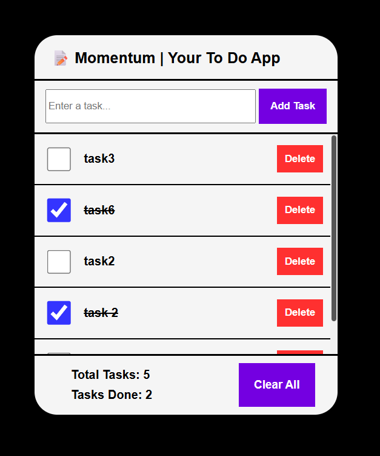

# Momentum - Your Personal To Do App
Momentum is a to-do list web application which helps you organize your tasks.

## Phase 1 : Version 1.0
It is the most basic version of the To Do App which allows user to add tasks, view tasks, delete taks etc.

### Objectives :
- To make a simple todo appp using basic HTML, CSS and Javascript.
- To learn and master basic fundamentals of web development and javascript.
- To create a web app without the use of any Co-Pilot or AI Code.

### Deliverables :
- Make a simple UI, single page application
- User should be able to add any task
- User should be able to see all the tasks
- User should be able to check and uncheck all the tasks present
- User should be able to delete any tasks at any time
- User should be able to see the total number of tasks and total number of tasks done
- User should be able to delete all the tasks at once

### Achieved Deliverables
✅ All deliverables have been successfully met.

### Snapshots
